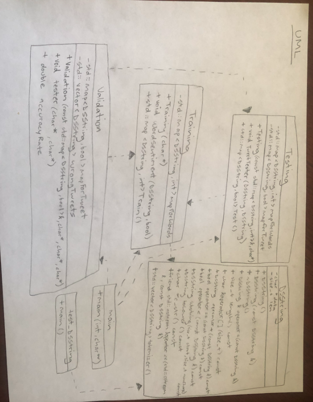

# Assignment 2: Answers

**Complete this document, commit your changes to Github and submit the repository URL to Canvas.** Keep your answers short and precise.

Your Name: Sophia Vasylyeva

Used free extension: [ ] 24 hrs or [ ] 48 hrs

[X] Early submission (48 hrs)

[ ] Bonus work. Describe: ...

Place [x] for what applies.

## UML Diagram

Add your UML class diagram here.

Replace the following image with your diagram. You can draw it by hand and take a photo.

## Answers

1. How do you train the model and how do you classify a new tweet? Give a short description of the main steps.

    > First, my Training class classified each word of the tweet as either positive or negative and populated a map for those words. Then, in the Testing class, based on those words and their value, a second map was created to summate the occurences of those words to produce either a positive or negative value, the sentiment of the whole tweet. Lastly, in the Validation class, the tester would compare with the sentiment my Tester produced with the correct sentiment of the tweet (in the file), and output those comparisons and results in an accuracy and results file.

2. How long did your code take for training and what is the time complexity of your training implementation (Big-Oh notation)? Remember that training includes reading the tweets, breaking it into words, counting, ... Explain why you get this complexity (e.g., what does `N` stand for and how do your data structures/algorithms affect the complexity).

   > The time complexity of the training is O(n m log(h)). This is because, there are an n number of tweets, and an m number of words per tweet, and for each work I insert it into a map of size h. Also, in my while loop, I called a function that contains a for loops, meaning I have nested loops.

3. How long did your code take for classification and what is the time complexity of your classification implementation (Big-Oh notation)? Explain why.

   > For classification, the time complexity is also O(n m log(h)). This is again, because I insert an n number of tweets and m number of words per tweet into a map of size h, in addition to having nested loops in my while loop.

4. What accuracy did your algorithm achieve on the provides training and test data? 

   > My accuracy: 66%

   The TA will run your code on Linux and that accuracy value will be used to determine your grade.

5. What were the changes that you made that improved the accuracy the most?
   
   > The first time the program compiled, the accuracy was 66% and still is. The implementation of the tokenizer, checking for out of bounds data, properly accounting for the null terminator, and using proper memory managment in combination resulted in a good accuracy rate.

6. How do you know that you use proper memory management? I.e., how do you know that you do not have
   a memory leak?

   > I checked for proper memory management by running valgrind on my completed program. It told me there were 0 bytes lost.

6. What was the most challenging part of the assignment?

   > Writing some of the functions for the DSString class were challenging because they were unfamiliar functions and it was hard to know where to start. Reading in the right parts of the files also got confusing, and keeping track of them across classes. Calling the correct contents of the file and maps got confusing because of their application across classes.